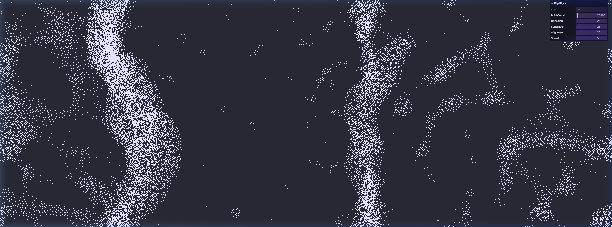

# Flip Flock

A highly optimized 2D boids simulation utilizing WebGPU compute shaders. Capable of smoothly rendering hundreds of thousands of individual entities in real-time by heavily leveraging parallel spatial-hashing algorithms.

<p align="center">
  
</p>

## Overview

This project simulates complex murmuration and flocking behaviors (cohesion, alignment, and separation) utilizing a custom $O(n)$ spatial hashing pipeline on the GPU. By bypassing traditional CPU constraints, the simulation renders staggering numbers of entities with beautiful organic clustering physics.

### Features
- **Massive Scale**: Simulates up to 500,000 boids at high framerates using highly parallel WebGPU compute shaders.
- **Toroidal Space**: Boids flow through an infinite wrap-around coordinate system, allowing clusters to form naturally without edge-bumping artifacts.
- **Spatial Hashing**: Utilizes counting sort and atomic operations (`countCells.wgsl`, `scatter.wgsl`) to bin entities into grid cells natively on the GPU, dropping neighbor collision checks from $O(n^2)$ to nearly $O(n)$.
- **Dynamic Aesthetic Control**: A built-in user interface (`lil-gui`) gives immediate, sliding control over visual range, velocity limits, and flocking rule weights.
  - Boids count can scale gracefully through memory pre-allocation.

## Architecture Pipeline

1. **`countCells.wgsl`** - Atomic incrementers bin every boid into a spatial grid cell.
2. **CPU Prefix Sum** - A near-instantaneous memory readback calculates grid offsets to ensure boids from the same cell fall sequentially in memory.
3. **`scatter.wgsl`** - Boids are rearranged into a contiguous sorted array in GPU memory mapping to their spatial cells.
4. **`updateBoids.wgsl`** - Core physics calculation. Because boids are sorted by space, each boid only checks the small memory slice corresponding to its neighboring 3x3 cells.
5. **`sprite.wgsl`** - High-performance instanced rendering maps the entity data into soft anti-aliased dots.

## Running Locally

Requirements: 
- Node.js & npm/bun
- A WebGPU-compatible browser (e.g. Chrome / Edge 113+, Safari Desktop Tech Preview)

1. Clone the repository.
2. Install dependencies:
   ```bash
   bun install
   ```
3. Boot up the Vite dev server:
   ```bash
   bun run dev
   ```
4. Navigate to the local URL (typically `http://localhost:5173`) and enjoy!
